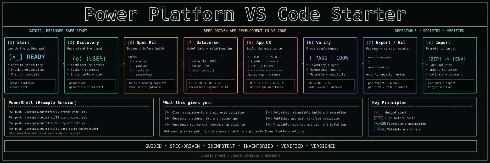

# Power Platform VS Code Starter



A repo-agnostic starter kit for building Power Platform model-driven apps from VS Code using the Power Platform CLI and Dataverse Web API. Clone it into any project to get a guided, scripted path from idea to working solution -- without manual portal clicks.

> [!IMPORTANT]
> **Spec Kit planning is a mandatory gate.** Do not run build scripts until your planning files are complete (`spec.md`, `plan.md`, and `tasks.md` in root or under `specs/<scenario-slug>/`). The wizard helps you create them.

---

## Start here

If Git, VS Code, and Copilot Chat are already available, use this single guided start:

```powershell
git clone https://github.com/bradlaw76/power-platform-vscode-starter
cd power-platform-vscode-starter
code .
```

When the folder opens in VS Code, open Copilot Chat and enter:

```text
/power-platform-wizard-init
```

If the slash command is not shown, enter this instead:

```text
Start the Power Platform wizard in this repository.
```

If `git` or `code` is not recognized, use the [first-time machine setup](#1-install-required-tools) below. You can also use GitHub's **Code > Download ZIP**, extract the folder, and open it with **File > Open Folder** in VS Code.

You do not need to work out the setup order first. Before the discovery wizard asks about your app, Copilot will:

1. Confirm that it is working in the repository you intended.
2. Inspect the repository and working tree without modifying tracked project files.
3. Run the non-destructive prerequisite check for VS Code, PowerShell 7, Azure CLI, Power Platform CLI (PAC CLI), and Git.
4. Explain any missing setup and help resolve it.
5. Ask whether this is a new build or retrofit of existing work, then whether to continue in chat or the terminal.

This initial setup writes local progress telemetry under `.wizard-metrics/` unless `WIZARD_METRICS_OPTOUT=1`. It does **not** sign in to Power Platform, create or change Dataverse resources, run build scripts, commit, or push. After setup passes, the wizard starts discovery and prepares the required Spec Kit planning files: `spec.md`, `plan.md`, and `tasks.md`.

---

## Table of Contents

- [Start here](#start-here)
- [What this repo is for](#what-this-repo-is-for)
- [Who this is for](#who-this-is-for)
- [Key concepts](#key-concepts)
- [How it works](#how-it-works)
- [Visual walkthrough](docs/wizard-walkthrough.html)
- [Getting started](#getting-started)
- [Install Spec Kit tooling](#install-spec-kit-tooling)
- [Build sequence](#build-sequence)
- [End-of-Build Analysis](#end-of-build-analysis)
- [Using VS Code chat and Claude Code](#using-vs-code-chat-and-claude-code)
- [Solution lifecycle](#solution-lifecycle)
- [Git workflow](#git-workflow)
- [Script reference](#script-reference)
- [Repo contents](#repo-contents)
- [Troubleshooting](#troubleshooting)
- [Related documents](#related-documents)

---

## What this repo is for

Use this starter when you want to:

- Build standalone model-driven Power Apps or extend Dynamics 365 from VS Code
- Replace manual portal clicks with repeatable, source-controlled scripts
- Plan work with Spec Kit artifacts before writing any metadata
- Package and promote results as a Power Platform solution across environments

**Core outcome:** Move from requirements to working Dataverse artifacts, packaged as a solution that can be exported, versioned in Git, and imported into any environment.

---

## Who this is for

| You are... | This repo gives you... |
| --- | --- |
| A first-time model-driven app builder new to VS Code | A step-by-step wizard with no assumed knowledge |
| A team that wants scripted, repeatable builds | Idempotent bootstrap scripts for every build phase |
| A repo needing a consistent onboarding contract | A single `docs/onboarding.md` any new person can follow in under an hour |

No prior experience needed with VS Code terminals, Git branches, PAC CLI, or Dataverse solution management. This documentation explains each term on first use.

---

## Key concepts

| Term | Meaning |
| --- | --- |
| **PAC CLI** | The Power Platform command-line tool (`pac`) for solution operations and environment auth |
| **Dataverse** | The data platform behind model-driven apps: tables, columns, relationships, forms, views |
| **Solution** | The deployable package containing your app components |
| **Unpack / Pack** | Convert a solution zip to editable source files (unpack), then rebuild the zip (pack) |
| **Spec Kit** | A planning method requiring `spec.md`, `plan.md`, and `tasks.md` before any implementation |
| **Claude Code skill** | A reusable workflow guide made available to Claude Code for AI-assisted builds |

---

## How it works

Primary entry point is the VS Code shared skill. Direct wizard routes remain supported and lead to the same planning/build sequence:

Prefer a clickable visual guide? Open [docs/wizard-walkthrough.html](docs/wizard-walkthrough.html).

| Entry point | How to start | Best for |
| --- | --- | --- |
| **VS Code shared skill (primary)** | `/power-platform-wizard-init` in Copilot Chat | Guided chat-or-terminal kickoff plus progress monitoring |
| **VS Code Copilot Chat (direct wizard path)** | `/power-platform-demo-wizard` in Copilot Chat | Direct chat-first planning and Spec Kit generation |
| **Terminal wizard** | `pwsh ./scripts/bootstrap/05-start-wizard.ps1` | Answer discovery questions interactively, scaffold planning files |
| **Claude Code skill** | Available after `01-install-skills.ps1` | AI-guided builds with full workflow and troubleshooting context |

All three paths converge on the same sequence:

```text
Discovery -> Spec Kit -> Demo script -> Dataverse schema -> App experience -> Solution export -> Git -> Import
```

Disclosed local usage metrics are available for wizard runs. Bootstrap scripts log non-identifying step progress to `.wizard-metrics/events.jsonl`, print a telemetry notice when they do so, and support opt-out with `WIZARD_METRICS_OPTOUT=1`.

---

## Getting started

The recommended path is the guided start above: open the repository and enter `/power-platform-wizard-init`. The sections below are the detailed manual setup reference. You can use them directly, or let the init skill walk through them and explain each result.

### 1. Install required tools

```powershell
winget install Microsoft.PowerShell
winget install Microsoft.AzureCLI
winget install Microsoft.PowerPlatformCLI
winget install Git.Git
```

Verify all tools are accessible:

```powershell
pwsh --version; az --version; pac --version; git --version; code --version
```

Each command must return a version number. Fix any failures before continuing.

---

### 2. Clone and open

```powershell
git clone https://github.com/bradlaw76/power-platform-vscode-starter
cd power-platform-vscode-starter
code .
```

When VS Code opens, accept the extension recommendations when prompted. If you missed the prompt, open Extensions (`Ctrl+Shift+X`), search `@recommended`, and install all.

**Extensions installed by this repo:**

| Extension | Purpose |
| --- | --- |
| GitHub Copilot | AI assistant |
| GitHub Copilot Chat | In-editor chat for the prompt-based wizard |
| Power Platform Tools | Maker portal and CLI integration |
| PowerShell | Terminal language support |
| JSON | Schema validation for payload files |
| Markdown lint | Documentation quality checks |
| YAML | Process definition file support |

---

### 3. Install Claude Code skills (once per machine)

```powershell
pwsh ./scripts/bootstrap/01-install-skills.ps1
```

Expected output:

```text
=== Install Claude Code Skills ===
Source: ..\.claude\skills
Dest:   C:\Users\<you>\.claude\skills

  INSTALLED power-platform-vscode-wizard

Done. Installed: 1  Skipped: 0
```

This copies the `power-platform-vscode-wizard` skill to `~/.claude/skills/` so it is available to Claude Code on this machine. Re-running is safe and picks up any skill updates from the repo.

For VS Code Copilot Chat users, this repo also includes a shared skill at `.github/skills/power-platform-wizard-init` that can be invoked as `/power-platform-wizard-init` without running the installer.

---

## Install Spec Kit tooling

If you are looking for "Speck Kit" installation: this repo uses **Spec Kit** as a planning gate and includes the setup path already. There is no separate external installer required for basic use.

Official upstream project:

- https://github.com/github/spec-kit/
- Docs: https://github.github.io/spec-kit/

Use this setup so Spec Kit artifacts can be created consistently:

1. Install repo skills (once per machine):

```powershell
pwsh ./scripts/bootstrap/01-install-skills.ps1
```

2. Start the guided planning flow (creates `spec.md`, `plan.md`, `tasks.md`):

```powershell
pwsh ./scripts/bootstrap/05-start-wizard.ps1
```

3. Optional chat-first path in VS Code Copilot Chat:

```text
/power-platform-demo-wizard
```

Optional: install the upstream Specify CLI from the official Spec Kit repo
(recommended if you also want full Spec Kit CLI workflows outside this starter):

Prerequisites from upstream: Python 3.11+, `uv` (recommended) or `pipx`, and Git.

```powershell
uv tool install specify-cli --from git+https://github.com/github/spec-kit.git@vX.Y.Z
```

Then initialize Spec Kit in any project:

```powershell
specify init my-project --integration copilot
```

Replace `vX.Y.Z` with a released tag from:
https://github.com/github/spec-kit/releases/latest

Validation checkpoint:

- `spec.md`, `plan.md`, and `tasks.md` exist in root or under `specs/<scenario-slug>/`.
- The three files are reviewed and consistent before running scripts `20` to `60`.

---

### 4. Check prerequisites

```powershell
pwsh ./scripts/bootstrap/00-prereq-check.ps1
```

All tools must show **PASS** before continuing. Install any that show **FAIL** using the install commands in step 1.

---

### 5. Run the discovery kickoff (primary: shared skill)

Primary path:

```text
/power-platform-wizard-init
```

Direct wizard alternatives (still supported):

```powershell
pwsh ./scripts/bootstrap/05-start-wizard.ps1
```

```text
/power-platform-demo-wizard
```

All paths capture the same architecture profile and 11 core discovery questions, then scaffold `spec.md`, `plan.md`, and `tasks.md` under `specs/<scenario-slug>/`.

Canonical source for discovery/planning/execution contract:

- `docs/wizard-contract-v1.md`
- `wizard.profile.json`

**Application profiles (selected before discovery):**

- `standalone-model-driven`: a normal Power Apps model-driven app, usually built from custom tables, with neutral operational report labels.
- `dynamics-sales-extension`, `dynamics-customer-service-extension`, or `dynamics-field-service-extension`: an extension that can reuse standard Dynamics tables and either create dedicated forms or update selected forms in place.
- `generic-dataverse-solution`: Dataverse components packaged in a solution with the same explicit app contract.

Every new profile-based run records its table/form strategy, primary entry-point table, named landing view, required app artifacts, and navigation group. The wizard creates or updates the model-driven review app on every run. App assembly places the entry-point table first in an app-aware sitemap and attaches the requested view; it does not change that table's environment-wide default view.

**Discovery questions:**

1. What type of demo or app are you building?
2. Is it for Dynamics 365 Sales, Customer Service, Field Service, Contact Center, Power Apps, Power Pages, Copilot Studio, or Dataverse?
3. Who is the target audience?
4. What business problem does it solve?
5. Who are the users?
6. What data tables or entities are needed?
7. What screens, forms, views, pages, flows, or copilots are needed?
8. What does a successful demo look like?
9. What environment should it be built in?
10. Does it need demo data?
11. Should the output be a managed or unmanaged solution?

**Optional extension blocks (profile-driven):**

- table strategy and explicit mapping
- solution identity (new/existing solution + publisher prefix)
- reporting module scope
- retrofit mode (current state + remaining work)

Exit criteria: all 11 answers captured and reviewed before moving to authentication.

---

### 6. Authenticate

```powershell
pwsh ./scripts/bootstrap/10-auth-connect.ps1
```

Prompts for environment URL, Azure tenant, publisher prefix, and solution names. Saves a local `.env.ps1` -- never committed (protected by `.gitignore`).

Solution safety rules in this step:

- The default path is `new` solution creation.
- Reusing an existing solution requires explicitly choosing `existing`.
- If you choose `new` and the solution unique name already exists, the script stops so you can enter a unique name instead of reusing the old solution by accident.

Additional auth modes:

```powershell
pwsh ./scripts/bootstrap/10-auth-connect.ps1 -UseDeviceCode    # No browser / remote machine
pwsh ./scripts/bootstrap/10-auth-connect.ps1 -ServicePrincipal # CI / service principal
```

Validation: `az account show` and `pac auth list` both return your profile and environment.

---

## Build sequence

> [!IMPORTANT]
> Do not run build scripts until your planning files are complete and reviewed (`spec.md`, `plan.md`, and `tasks.md` in root or under `specs/<scenario-slug>/`). This is a hard gate -- building before planning creates rework.

Optional but recommended before authentication and build scripts:

```powershell
pwsh ./scripts/bootstrap/06-demo-script-wizard.ps1 -ScenarioSlug <scenario-slug>
```

This second wizard reads the scenario created by `05-start-wizard.ps1`, suggests a business use case, asks for the hero record and demo emphasis, and generates:

- `demo-walkthrough.md` (engineer/operator runbook)
- `demo-talk-track.md` (presenter narrative)
- `demo-script.md` (compatibility copy of the talk track)

Add payload files to `payloads/` before running scripts:

| File pattern | Contents |
| --- | --- |
| `payloads/table-*.json` | Table definitions |
| `payloads/columns-*.json` | Column definitions |
| `payloads/relationships-*.json` | Lookup relationship definitions |

Before payload generation, planning must include an explicit mapping section:

- Standard reused tables (mapped to Dataverse logical names, e.g., Case -> incident)
- Custom tables to create (generated with the selected publisher prefix)
- Standard fields reused
- Custom fields to add
- Relationships to create

Rules:

- Never put standard entities (Contact, Account, Case/incident, Lead, Opportunity, Product, Task, Activity, etc.) in table-creation payloads.
- Table payloads must contain only true custom entities.
- Column and relationship payloads may target both standard and custom entities.

Forms and labels rules:

- `60-build-forms-views.ps1` builds Starter Main Form controls from `columns-*.json` for each custom table in `table-*.json`.
- Primary name field is placed first, then payload-defined fields in payload order.
- Visible labels use payload `DisplayName.LocalizedLabels` (language 1033 first, then first available).
- Missing labels fall back to friendly title-case labels from logical names (prefix removed, underscores replaced with spaces).
- If Starter Main Form exists, reruns patch its form XML to apply payload field/label changes.
- If a non-starter Main form exists, starter form creation/update is skipped.

Run build scripts in order:

```powershell
pwsh ./scripts/bootstrap/15-dry-validate.ps1
pwsh ./scripts/bootstrap/20-build-tables.ps1
pwsh ./scripts/bootstrap/30-build-columns.ps1
pwsh ./scripts/bootstrap/40-build-relationships.ps1
pwsh ./scripts/bootstrap/50-add-to-solution.ps1
pwsh ./scripts/bootstrap/55-build-business-process-flows.ps1 -ScenarioSlug <scenario-slug>
pwsh ./scripts/bootstrap/60-build-forms-views.ps1
pwsh ./scripts/bootstrap/62-build-app-module.ps1 -ScenarioSlug <scenario-slug>
# Optional if enabled by profile + planning selection
pwsh ./scripts/bootstrap/70-build-web-resources.ps1 -ScenarioSlug <scenario-slug>
# Final read-only inventory and export gate
pwsh ./scripts/bootstrap/50-add-to-solution.ps1 -ScenarioSlug <scenario-slug> -InventoryOnly -EnforceExportGate
# End-of-build analysis
pwsh ./scripts/bootstrap/80-post-build-analysis.ps1 -ScenarioSlug <scenario-slug>
# Generate a progress matrix from disclosed step events
pwsh ./scripts/bootstrap/81-build-progress-matrix.ps1
# Generate an HTML analytics dashboard from telemetry
pwsh ./scripts/bootstrap/82-build-progress-report.ps1
```

After each script: check that the failed count is zero before running the next. All scripts are idempotent -- safe to rerun after fixing any failure.

Solution isolation behavior:

- `50-add-to-solution.ps1` derives the expected table set from payload references and fails fast if the target solution already contains foreign table components.
- `50-add-to-solution.ps1` also writes a contamination scan artifact covering expected components, wizard-managed foreign artifacts, and manual or legacy artifacts in the solution.
- Strict mode is on by default. Override only for intentional reuse with `pwsh ./scripts/bootstrap/50-add-to-solution.ps1 -FailIfSolutionHasForeignTables:$false`.
- To review or remove foreign tables from an existing unmanaged solution, use `pwsh ./scripts/bootstrap/57-prune-foreign-tables.ps1`.
- `55-build-business-process-flows.ps1` validates explicit `process-*.json` input and generates a Power Apps designer handoff. Apply mode requires the matching category-4 process to exist through that supported designer/solution path; the script then validates, activates, adds, and links it without fabricating workflow definition metadata.
- If the scenario only defines CRUD tables without a staged business progression, script 55 skips BPF generation and explains why in its report artifact.
- `60-build-forms-views.ps1` applies quality gates to forms and views and writes population artifacts for both.
- `62-build-app-module.ps1` creates or updates the scenario-aware model-driven app shell and validates its attached components.
- The final inventory-only pass records all mandatory and optional categories with Dataverse IDs and blocks export when required membership fails. Strict mode also blocks unauthorized components.
- See [docs/solution-isolation-runbook.md](docs/solution-isolation-runbook.md) for the clean-build, detection, and cleanup flows.

**After script 60:** Open [Power Apps Maker](https://make.powerapps.com), select your environment, and confirm tables, forms, and views appear inside the target solution before exporting.

Optional report web resources:

- `05-start-wizard.ps1` captures a yes/no decision for optional reporting module scope (when enabled in `wizard.profile.json`).
- `70-build-web-resources.ps1` is the canonical optional module entrypoint.
- `65-build-web-resources.ps1` remains the implementation script called by `70-build-web-resources.ps1`.
- The script upserts Dataverse HTML web resources and adds them to the selected solution.

Wizard step metrics:

- Bootstrap scripts disclose local step-progress telemetry and write events to `.wizard-metrics/events.jsonl`.
- Events include run ID, step code, status, and timestamps only; they do not include user name, machine name, email, or access tokens.
- Use `pwsh ./scripts/bootstrap/81-build-progress-matrix.ps1` to generate a run matrix showing which steps each user/run completed or dropped off on.
- Set `WIZARD_METRICS_OPTOUT=1` before running a script if you want to disable local telemetry for that session.

## End-of-Build Analysis

`80-post-build-analysis.ps1` produces a concise end-of-build summary and prints a preview before any write action.

It also generates a build mind map artifact for wizard-driven builds, visualizing what was created and how entities relate.

It reads:

- `specs/<scenario>/spec.md`
- `specs/<scenario>/plan.md`
- `specs/<scenario>/tasks.md`
- `scripts/payloads/table-*.json` and/or `payloads/table-*.json`
- `scripts/payloads/columns-*.json` and/or `payloads/columns-*.json`
- `scripts/payloads/relationships-*.json` and/or `payloads/relationships-*.json`
- `scripts/payloads/webresource-*.json` and/or `payloads/webresource-*.json`
- `README.md`

Optional overrides for generalized workflows:

- `-SpecPath`
- `-PlanPath`
- `-TasksPath`
- `-PayloadFolder`
- `-ReadmePath`
- `-MindMapOutputPath`

If one or more inputs are missing, summary sections render `Not available` instead of failing.

Generated mind map artifacts:

- `.wizard-metrics/artifacts/analysis/build-mind-map.md` (Mermaid graph)
- `.wizard-metrics/artifacts/analysis/build-mind-map.json` (structured data)

Interactive flow:

- Prompt: `Update README generated summary section now? (y/N)`.
- If yes: replace only the content between the generated summary markers.
- Prompt: `Stage and commit README update now? (y/N)`.
- If yes: show repository-target safety checks (`git rev-parse --show-toplevel`, `git remote -v`, `git branch --show-current`) and require explicit confirmation before commit/push.
- Prompt: `Push to origin/<current-branch> now? (y/N)` before any push.

Preview mode:

```powershell
pwsh ./scripts/bootstrap/80-post-build-analysis.ps1 -ScenarioSlug <scenario-slug> -PreviewOnly
```

Progress matrix:

```powershell
pwsh ./scripts/bootstrap/81-build-progress-matrix.ps1
```

Default output is written to `.wizard-metrics/build-progress-matrix.md`.

HTML progress dashboard:

```powershell
pwsh ./scripts/bootstrap/82-build-progress-report.ps1
```

Outputs:

- `.wizard-metrics/build-progress-data.json` (analytics snapshot)
- `.wizard-metrics/build-progress-report.html` (self-contained dashboard)
- `.wizard-metrics/artifacts/analysis/build-mind-map.md` (build relationship mind map)
- `.wizard-metrics/artifacts/analysis/build-mind-map.json` (mind map source data)

Open the report:

- Wizard Progress Report: `.wizard-metrics/build-progress-report.html`
- Wizard Progress Data (JSON): `.wizard-metrics/build-progress-data.json`

Note: these links are local workspace artifacts. Run `pwsh ./scripts/bootstrap/82-build-progress-report.ps1` first if the files do not exist yet.

Update model:

- New work appends events to `.wizard-metrics/events.jsonl`.
- Re-run `82-build-progress-report.ps1` to refresh JSON + HTML from latest events.
- If you only want to re-render HTML from existing JSON, use: `pwsh ./scripts/bootstrap/82-build-progress-report.ps1 -SkipRefresh`.

BEGIN GENERATED BUILD SUMMARY
### Scenario and solution metadata
- Scenario slug: contoso-case-tracker
- Scenario summary: Contoso Case Tracker is a Model-driven app for tracking customer support cases for Dynamics 365 Customer Service.
- Environment: https://contoso-dev.crm.dynamics.com
- Solution type: Unmanaged
- Solution unique name: ContosoCaseTracker (new)
- Publisher prefix: cct (new)

### Tables built (standard table extensions and custom tables)
- Standard table extensions:
  - incident (columns: cct_escalationreason, cct_triagebucket)
- Custom tables:
  - Agent -> cct_agent
  - Customer -> cct_customer
  - Priority -> cct_priority

### Relationship map
- incident (referencing) -> cct_agent (referenced)
- incident (referencing) -> cct_priority (referenced)
- incident (referencing) -> contact (referenced)
- incident.cct_agentid -> cct_agent (cct_incident_cct_agent)

### Forms and views created or updated
- Case form
- active cases view

### Web resources created or updated
- (none detected)

### Demo talk track
- Demo Talk Track: Contoso Case Tracker - Run the end-to-end Contoso Case Tracker story from intake through closure, using Case, Customer, Agent, Priority and proving 'Agent opens a case, fills the f...

### Recommended next enhancements
- Identify tables requiring report surfaces (greenfield: from spec/tasks; retrofit: from existing solution inventory)
- Decide demo data approach: Yes
- Create Report Mapping Table in 'report-mappings.md' with one row per report (table logical name, report surface name, report type, target placement, required fields, Dataverse owner)
- For each table marked critical: confirm explicit report type decision (form web resource, dashboard KPI, or queue/view summary)
- For each report, document decision that report supports (e.g., case escalation, agent performance, SLA risk)
- Define report-level placement (form iframe, dashboard tile, view footer, or ribbon notification)
END GENERATED BUILD SUMMARY
Validation scenarios to run for every workflow change:

- Standard-only model: `table-*.json` includes no standard entities, and no custom duplicates (for example, `<prefix>_case`, `<prefix>_contact`) are created.
- Custom-only model: all required entities are created with the chosen prefix in lowercase logical form.
- Mixed model: standard entities are reused, only true custom entities are created, custom fields can be added to standard entities, and mixed relationships plus payload-referenced solution assembly succeed.
- Uppercase prefix input: users can enter mixed/uppercase prefix input, entity logical names and script filtering behave in lowercase consistently, and the dry check command is `pwsh ./scripts/bootstrap/15-dry-validate.ps1 -PayloadsFolder "./payloads/scenarios/mixed" -PublisherPrefixOverride "CcT"`.
- Form-label and rerun behavior: new custom table forms show business labels such as `Priority Code` rather than raw logical names, rerunning after payload label updates patches Starter Main Form labels, non-starter Main forms remain untouched, and repeated runs do not create duplicate starter forms.

---

## Using VS Code chat and Claude Code

### Copilot Chat prompts

```text
/power-platform-wizard-init path=terminal mode=full
/power-platform-demo-wizard Create a Dynamics 365 Customer Service demo for case triage
Walk me through this repo like a beginner wizard
Ask me the discovery questions one at a time and help me write spec.md, plan.md, and tasks.md
```

### Claude Code skill

After running `01-install-skills.ps1`, the `power-platform-vscode-wizard` skill is installed on this machine and available in Claude Code sessions. The skill provides the full wizard workflow, validation checkpoints, script reference, solution lifecycle commands, and troubleshooting.

### VS Code shared skill

This repo includes `.github/skills/power-platform-wizard-init`. In Copilot Chat, invoke `/power-platform-wizard-init` to choose chat or terminal kickoff, enforce planning gates, and monitor progress from existing telemetry.

### How the entry points connect

```text
VS Code shared skill (primary) -> path selection + progress monitoring -> same planning artifacts -> build scripts
Direct wizard routes            -> same planning artifacts              -> build scripts
Terminal wizard               -> spec.md, plan.md, tasks.md -> demo-walkthrough.md + demo-talk-track.md -> build scripts
Copilot Chat                  -> same planning artifacts     -> demo-walkthrough.md + demo-talk-track.md -> build scripts
Claude Code skill (available) -> guides the entire flow      -> inline help at each step
```

---

## Solution lifecycle

After validating in the Maker portal, use PAC CLI to source-control the solution:

```powershell
# Export unmanaged solution from source environment
pac solution export --name "<SolutionName>" --path "./out/<SolutionName>_unmanaged.zip" --managed false

# Unpack to editable source files (diff-friendly in Git)
pac solution unpack --zipfile "./out/<SolutionName>_unmanaged.zip" --folder "./solutions/<SolutionName>" --packagetype Unmanaged

# Pack source files back into a zip
pac solution pack --zipfile "./out/<SolutionName>_unmanaged_new.zip" --folder "./solutions/<SolutionName>" --packagetype Unmanaged

# Import into target environment
pac solution import --path "./out/<SolutionName>_unmanaged_new.zip"
```

Unpacked solution files can be diffed, reviewed in pull requests, and rolled back via Git history. The pack/import pattern gives a repeatable, reversible promotion path across environments.

---

## Git workflow

```powershell
git checkout -b feature/<short-description>
git status
git add .
git commit -m "Add <feature> Dataverse artifacts and docs"
git push -u origin feature/<short-description>
```

`git status` must show a clean working tree after commit. Never commit `.env.ps1` -- it contains tokens and is protected by `.gitignore`. Verify with `git status` before every commit.

Release and rollback references for this update bundle:

- Release tag: `payload-wizard-bundle-20260713`
- Rollback tag: `rollback-before-all-20260713`
- To consume this bundle from another repo, fetch tags from `origin` and cherry-pick or base your branch on the release tag.
- To revert locally, use the rollback tag or `git revert` against the release commit if you want a non-destructive undo.

---

## Script reference

| Script | Purpose | Changes environment? | Safe to rerun? |
| --- | --- | --- | --- |
| `00-prereq-check.ps1` | Verify all required tools are installed | No | Yes |
| `01-install-skills.ps1` | Copy Claude Code skills to `~/.claude/skills/` | Local only | Yes |
| `05-start-wizard.ps1` | Run discovery questions, scaffold Spec Kit files | No | Yes (prompts before overwrite) |
| `06-demo-script-wizard.ps1` | Generate scenario-aware `demo-walkthrough.md` and `demo-talk-track.md` (plus compatibility `demo-script.md`) | No | Yes (prompts before overwrite) |
| `07-demo-dry-run.ps1` | Rehearse a generated demo script and capture notes in `demo-dry-run.md` | No | Yes (prompts before overwrite) |
| `10-auth-connect.ps1` | Sign in, create PAC auth profile, save `.env.ps1` | Local only | Yes |
| `15-dry-validate.ps1` | Validate planning artifacts, payload prerequisites, optional report/BPF/app inputs, and emit contract artifacts before mutation | No | Yes |
| `20-build-tables.ps1` | Create Dataverse tables from `payloads/table-*.json` | Yes | Yes |
| `30-build-columns.ps1` | Add columns from `payloads/columns-*.json` | Yes | Yes |
| `40-build-relationships.ps1` | Create lookups from `payloads/relationships-*.json` | Yes | Yes |
| `50-add-to-solution.ps1` | Add payload entities; in `-InventoryOnly` mode, read all-category membership, preserve IDs, and enforce the export gate without Dataverse mutation | Yes, except inventory-only mode | Yes |
| `55-build-business-process-flows.ps1` | Validate optional `process-*.json`, generate the supported designer handoff, and validate/activate/add/link an existing designer-authored BPF | Yes in apply mode; preview is local only | Yes |
| `60-build-forms-views.ps1` | Build payload-driven Starter Main Forms (create/update/skip) and Active views for payload-defined custom entities, then publish customizations | Yes | Yes |
| `62-build-app-module.ps1` | Create or update the scenario-aware model-driven app shell, attach intended components, and validate the resulting app | Yes | Yes |
| `70-build-web-resources.ps1` | Canonical optional reporting module entrypoint (wrapper) | Yes | Yes |
| `65-build-web-resources.ps1` | Generate optional scenario-driven HTML report web resources (agent, supervisor, executive KPI) and add them to solution | Yes | Yes |
| `80-post-build-analysis.ps1` | Generate post-build summary, optional README marker update, and optional guarded git commit/push prompts | No (unless user approves git actions) | Yes |
| `81-build-progress-matrix.ps1` | Summarize disclosed wizard telemetry into a per-run step matrix | No | Yes |
| `82-build-progress-report.ps1` | Generate a local HTML dashboard from wizard telemetry analytics | No | Yes |

---

## Repo contents

```text
power-platform-vscode-starter/
  .claude/
    skills/
      power-platform-vscode-wizard/
        SKILL.md              -- Claude Code skill: wizard workflow, scripts, troubleshooting
  .github/
    copilot-instructions.md   -- Repo-wide Copilot Chat behavior and workflow guidance
    skills/
      power-platform-wizard-init/
        SKILL.md              -- Shared Copilot skill: dual-path wizard kickoff + progress monitoring
        references/progress-monitoring.md -- Telemetry-based status guidance
    prompts/
      power-platform-demo-wizard.prompt.md -- Slash prompt for guided chat-based wizard
  .vscode/
    extensions.json           -- Recommended extensions (installs on first open)
  .gitignore                  -- Protects .env.ps1 and .wizard-metrics/ from accidental commits
  docs/
    onboarding.md             -- Step-by-step setup guide for new builders
    build-log.md              -- Log template for recording each build run
    wizard-contract-v1.md     -- Canonical workflow contract (discovery/planning/execution)
  payloads/                   -- Add table-*.json, columns-*.json, relationships-*.json here
  requirements/
    how-to-build-dynamics-model-driven-apps-in-vscode-with-copilot.md  -- Full implementation playbook
    how-to-build-dynamics-model-driven-apps-wizard.md                  -- Guided wizard and Spec Kit steps
  scripts/
    ci/
      test-docs-consistency.ps1  -- Guardrail: docs/prompt question-contract consistency
      test-script-order.ps1      -- Guardrail: docs/prompt script-order consistency
      test-script-smoke.ps1      -- Guardrail: reliability smoke checks (relationships/add-to-solution/view layout)
  scripts/
    bootstrap/
      00-prereq-check.ps1          -- Verify tools are installed (no changes made)
      01-install-skills.ps1        -- Copy Claude Code skills to ~/.claude/skills/
      05-start-wizard.ps1          -- Discovery questions -> Spec Kit starter files
      10-auth-connect.ps1          -- Sign in, configure PAC auth, save session
      15-dry-validate.ps1         -- Validate planning artifacts and payload prerequisites before mutation
      20-build-tables.ps1          -- Create tables from payloads/table-*.json
      30-build-columns.ps1         -- Add columns from payloads/columns-*.json
      40-build-relationships.ps1   -- Create lookups from payloads/relationships-*.json
      50-add-to-solution.ps1       -- Add payload-referenced entities to target solution
      55-build-business-process-flows.ps1 -- Validate and build optional Business Process Flows
      60-build-forms-views.ps1     -- Build payload-driven Starter Main Forms and Active views, then publish
      62-build-app-module.ps1      -- Create or update the scenario-aware model-driven app shell
      65-build-web-resources.ps1   -- Generate optional scenario-driven HTML report web resources and add to solution
      70-build-web-resources.ps1   -- Canonical optional reporting module entrypoint (wrapper)
      80-post-build-analysis.ps1   -- Post-build summary generation and optional README update/commit prompts
      81-build-progress-matrix.ps1 -- Build a run matrix from disclosed wizard telemetry events
      82-build-progress-report.ps1 -- Build an HTML dashboard from wizard telemetry analytics
      helpers/wizard-telemetry.ps1 -- Shared local telemetry helper for bootstrap steps
      wizard.profile.json          -- Project profile (required questions, modules, sequencing, conventions, gates)
      MIGRATION.md                 -- Upgrade guidance and compatibility expectations
```

---

## Troubleshooting

| Symptom | Likely cause | Fix |
| --- | --- | --- |
| `pac` not found | CLI not installed or PATH not updated | `winget install Microsoft.PowerPlatformCLI`, close and reopen terminal |
| 401 on every API call | Token resource URL mismatch | Rerun `10-auth-connect.ps1` -- no trailing slash on environment URL |
| Token works then stops mid-run | Token expired (60-90 min timeout) | Rerun `10-auth-connect.ps1` to refresh |
| PAC errors after `az login` | PAC and Azure CLI are separate auth mechanisms | Run both `az login` and `pac auth create` |
| Login opens wrong tenant | Multiple tenants on account | Pass `-tenantId` flag or rerun auth with explicit tenant |
| Solution not found in script 50 | Solution does not exist in environment yet | Create solution in Maker portal, then rerun `50-add-to-solution.ps1` |
| BPF build skipped | No `process-*.json` exists or the scenario has no clear staged progression | Leave BPF disabled or add a complete process definition with stages, fields, and criteria |
| BPF validation failed | Stage fields, primary entity, or cross-table relationships are missing or ambiguous | Fix `process-*.json`, explicit field mappings in planning artifacts, or the missing relationship payloads, then rerun `55-build-business-process-flows.ps1` |
| Build script fails midway | Any error during execution | Scripts are idempotent -- fix issue and rerun the same script |
| `code` command not found | VS Code shell command not in PATH | Command palette -> "Shell Command: Install 'code' command in PATH", restart terminal |
| `git push` rejected | Branch behind remote | `git pull --ff-only`, then push with `-u origin <branch>` |
| `.env.ps1` accidentally staged | `.gitignore` changed or bypassed | `git rm --cached .env.ps1`, verify `.gitignore` includes `.env.ps1` |
| Unpack fails | Wrong zip path or invalid export | Re-run export, verify zip exists in `out/`, then re-run unpack |
| Import fails: missing dependencies | Target environment missing base components | Import into correct base environment or include required dependencies |

---

## Related documents

| Document | Purpose |
| --- | --- |
| [docs/onboarding.md](docs/onboarding.md) | Complete step-by-step setup guide with validation checkpoints and common issues |
| [docs/wizard-walkthrough.html](docs/wizard-walkthrough.html) | Full visual walkthrough with direct links to skill entry points, scripts, and runbooks |
| [docs/build-log.md](docs/build-log.md) | Template for recording each build run for traceability |
| [docs/wizard-contract-v1.md](docs/wizard-contract-v1.md) | Canonical workflow contract for discovery, planning, and execution |
| [docs/standard-dataverse-tables.md](docs/standard-dataverse-tables.md) | Reference for standard (out-of-box) vs. custom Dataverse tables -- helps you decide which to reuse and which to create |
| [requirements/how-to-build-dynamics-model-driven-apps-in-vscode-with-copilot.md](requirements/how-to-build-dynamics-model-driven-apps-in-vscode-with-copilot.md) | Full implementation playbook |
| [requirements/how-to-build-dynamics-model-driven-apps-wizard.md](requirements/how-to-build-dynamics-model-driven-apps-wizard.md) | Guided discovery wizard, Spec Kit steps, and architecture decision framework |
| [MIGRATION.md](MIGRATION.md) | Migration guidance for existing consumers moving to the contract/profile model |
